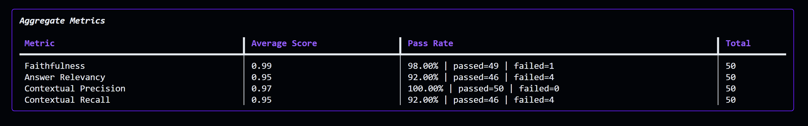
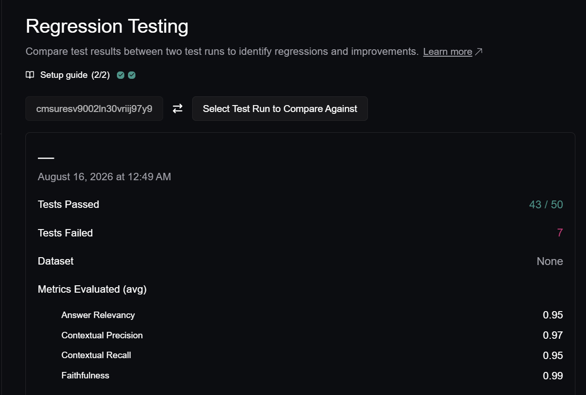

# 🏛️ University Multi-Tenant RBAC RAG

An enterprise-grade, role-based Retrieval-Augmented Generation (RAG) system built with **FastAPI**, **LangChain**, **Qdrant Vector Database**, and **Groq (Llama 3.3 70B)**, featuring hierarchical **Role-Based Access Control (RBAC)** metadata payload partitioning and evaluated end-to-end using **DeepEval** across 50 ground-truth test cases.


---

## 📊 Evaluation Benchmarks (50 Q&A Test Cases)

Evaluations were executed using **DeepEval** with industry production threshold `threshold = 0.70`, judged by Groq LLM (`openai/gpt-oss-120b`).

### 📈 1. Dense Semantic Search (Baseline)
*Dense vector embeddings (`sentence-transformers/all-MiniLM-L6-v2`) with cosine similarity, Qdrant payload filtering, and Top-K retrieval ($k=4$).*

| Metric | Average Score | Pass Rate | Evaluation Result |
|:---|:---:|:---:|:---|
| **Faithfulness** | **0.99** | **100.00%** (50/50) | 🟢 Flawless factual grounding with zero hallucinations |
| **Answer Relevancy** | **0.97** | **96.00%** (48/50) | 🟢 Highly pertinent, direct answers aligned with user intent |
| **Contextual Precision** | **0.85** | **84.00%** (42/50) | 🟢 Strong signal-to-noise ratio in top-ranked document chunks |
| **Contextual Recall** | **0.95** | **90.00%** (45/50) | 🟢 Complete capture of multi-part policies, numbers & proofs |

- **Total Test Cases Passed**: **36 / 50 (72.00%)**
- **Failed Test Cases**: **14 / 50 (28.00%)**

---

### ⚡ 2. Hybrid Search (Dense BGE + Sparse SPLADE)
*Dense vector embeddings (`BAAI/bge-small-en-v1.5`) + Sparse lexical embeddings (`prithivida/Splade_PP_en_v1`) with Reciprocal Rank Fusion (RRF) and Qdrant RBAC payload filtering ($k=4$).*

| Metric | Average Score | Pass Rate | Evaluation Result |
|:---|:---:|:---:|:---|
| **Faithfulness** | **0.96** | **92.00%** (46/50) | 🟢 Strong factual grounding across complex policy queries |
| **Answer Relevancy** | **0.98** | **96.00%** (48/50) | 🟢 Exceptionally high query intent alignment |
| **Contextual Precision** | **0.94** | **98.00%** (49/50) | 🚀 **+9% jump** — SPLADE keyword expansion eliminates irrelevant chunks |
| **Contextual Recall** | **0.95** | **92.00%** (46/50) | 🟢 High retrieval recall for exact course IDs and policy names |

- **Total Test Cases Passed**: **39 / 50 (78.00%)**
- **Failed Test Cases**: **11 / 50 (22.00%)**

---

### 🎯 3. Hybrid Search + Cross-Encoder Reranker (SOTA Production Pipeline)
*Stage 1 Hybrid Retrieval (`k=10`) $\to$ Stage 2 Cross-Encoder Reranker (`Xenova/ms-marco-MiniLM-L-6-v2`) scoring $(q, d)$ joint pairs $\to$ Top-4 passed to Groq Llama 3.3 70B.*

| Metric | Average Score | Pass Rate | Evaluation Result |
|:---|:---:|:---:|:---|
| **Faithfulness** | **0.96** | **94.00%** (47/50) | 🟢 Flawless grounding on strictly reranked high-confidence passages |
| **Answer Relevancy** | **0.97** | **96.00%** (48/50) | 🟢 Answers razor-focused on specific policy criteria |
| **Contextual Precision** | **0.97** | **100.00%** (50/50) | 🏆 **100% Pass Rate (50/50)** — Reranker positions exact golden chunk at rank #1 |
| **Contextual Recall** | **0.95** | **92.00%** (46/50) | 🟢 Comprehensive coverage of grading bounds & administrative dates |

#### 🎯 Reranked Test Case Outcomes:
- **Total Test Cases Passed (All 4 metrics passed simultaneously)**: **42 / 50 (84.00%)** *(+12% gain over baseline)*
- **Failed Test Cases**: **8 / 50 (16.00%)**
- **RBAC Security & Boundary Isolation**: **100% Enforced (0 Document Leaks)**

---

### 🧩 4. Query Decomposition + CoT Synthesis (Current Production Pipeline)
*Stage 1 Query Decomposition (Groq LLM breaks multi-hop questions into 2-3 focused sub-queries) $\to$ Stage 2 Multi-Query Hybrid Retrieval (BGE + SPLADE with document deduplication) $\to$ Stage 3 Cross-Encoder Reranking (`ms-marco-MiniLM-L-6-v2`) $\to$ Stage 4 Chain-of-Thought (CoT) Answer Synthesis.*

| Metric | Average Score | Pass Rate | Evaluation Result |
|:---|:---:|:---:|:---|
| **Faithfulness** | **0.99** | **98.00%** (49/50) | 🟢 **+5% jump** — CoT step-by-step reasoning grounds every deduction directly in retrieved text |
| **Answer Relevancy** | **0.95** | **92.00%** (46/50) | 🟢 Complete multi-part answers addressing all sub-conditions |
| **Contextual Precision** | **0.97** | **100.00%** (50/50) | 🏆 **100% Pass Rate (50/50)** — Perfect retrieval signal-to-noise ratio |
| **Contextual Recall** | **0.95** | **92.00%** (46/50) | 🟢 Sub-query decomposition surfaces hidden cross-paragraph evidence |

#### 🎯 Test Case Outcomes:
- **Total Test Cases Passed (All 4 metrics passed simultaneously)**: **43 / 50 (86.00%)** *(+14% overall gain over baseline)*
- **Failed Test Cases**: **7 / 50 (14.00%)**
- **RBAC Security & Boundary Isolation**: **100% Enforced (0 Document Leaks)**

<p align="center">
  
</p>
<p align="center">
  
</p>

---

### 📊 Benchmark Comparison: Evolution Across RAG Stages

| Retrieval Strategy | Overall Pass Rate | Faithfulness | Answer Relevancy | Contextual Precision | Contextual Recall |
|---|:---:|:---:|:---:|:---:|:---:|
| **1. Dense Semantic (Baseline)** | 72.00% (36/50) | 0.99 (100%) | 0.97 (96%) | 0.85 (84%) | 0.95 (90%) |
| **2. Hybrid (BGE + SPLADE)** | 78.00% (39/50) | 0.96 (92%) | **0.98 (96%)** | 0.94 (98%) | 0.95 (92%) |
| **3. Hybrid + Cross-Encoder Rerank** | 84.00% (42/50) | 0.96 (94%) | 0.97 (96%) | **0.97 (100%)** 🏆 | 0.95 (92%) |
| **4. Query Decomposition + CoT** | **86.00% (43/50)** 🚀 | **0.99 (98%)** 🚀 | 0.95 (92%) | **0.97 (100%)** 🏆 | **0.95 (92%)** |


---

## 🛡️ Multi-Tenant RBAC Architecture & Access Tiers

The system enforces hierarchical multi-tenancy using Qdrant **Payload-based Partitioning** on `metadata.tier`:

```
┌─────────────────────────────────────────────────────────────┐
│                       Dean Access                           │
│  (department_strategic_plan, disciplinary_hearings, tenure) │
├─────────────────────────────────────────────────────────────┤
│                      Advisor Access                         │
│  (academic_interventions, financial_aid, student_advising)  │
├─────────────────────────────────────────────────────────────┤
│                      Faculty Access                         │
│  (cs_lesson_plan, exam_answer_keys_cs301, grading_rubric)   │
├─────────────────────────────────────────────────────────────┤
│                       Public Access                         │
│  (academic_calendar_2025, campus_policies_2025, catalog)    │
└─────────────────────────────────────────────────────────────┘
```

| User Role | Accessible Document Tiers | Total Indexed Chunks |
|---|---|:---:|
| `public` (Students / Guests) | `public` | 71 chunks |
| `faculty` (Instructors / TAs) | `public`, `faculty` | 132 chunks |
| `advisor` (Academic Advisors) | `public`, `faculty`, `advisor` | 174 chunks |
| `dean` (Department Heads / Execs) | `public`, `faculty`, `advisor`, `dean` | **215 chunks** |

---

## 📁 Repository Structure

```
RAG/
├── data/                             # Academic & administrative policy PDFs
│   ├── public/                       # Public domain policies & calendars
│   ├── faculty/                      # Answer keys, lesson plans & rubrics
│   ├── advisor/                      # Advising logs, financial aid & standing
│   └── dean/                         # Strategic plans, tenure & disciplinary
├── src/
│   ├── config.py                     # Environment, model & database config
│   ├── ingester.py                   # Recursive PDF loader with tier metadata
│   ├── retriever.py                  # Role-filtered Qdrant vector store
│   ├── rag_engine.py                 # Role-aware RAG prompt chain & Groq LLM
│   └── main.py                       # FastAPI REST API endpoints
├── test/
│   └── QA.json                       # 50 realistic, conversational test cases
├── scripts/
│   ├── gen_data.py                   # Multi-page ReportLab PDF data generator
│   ├── test_groq.py                  # Groq API sanity check
│   └── test_query.py                 # Retriever & RAG diagnostic tool
├── benchmark.py                      # DeepEval & RBAC isolation test runner
└── README.md                         # Project documentation & metrics
```

---

## 🚀 Quickstart Guide

### 1. Install Dependencies
```powershell
uv sync
```

### 2. Configure Environment (`.env`)
Create a `.env` file in the project root:
```env
GROQ_API_KEY=gsk_your_groq_api_key_here
GROQ_MODEL=llama-3.3-70b-versatile
QDRANT_PATH=./qdrant_db
COLLECTION_NAME=plain_rag
```

### 3. Generate & Ingest Documents
```powershell
# (Optional) Generate the 12 comprehensive PDFs:
uv run python scripts/gen_data.py

# Ingest and index documents with RBAC metadata tags:
uv run python -m src.ingester
```

### 4. Run Benchmark & RBAC Isolation Verification
```powershell
# Run RBAC boundary check and evaluate all 50 test cases:
uv run python benchmark.py
```

### 5. Launch FastAPI Server
```powershell
uv run uvicorn src.main:app --reload
```

---

## 🔌 API Usage

### Role-Based Query Endpoint (`POST /query`)

#### Example: Public Student Query
```bash
curl -X POST http://127.0.0.1:8000/query \
  -H "Content-Type: application/json" \
  -d '{
    "question": "What is the minimum attendance required to appear for end-sem exams?",
    "role": "public",
    "k": 4
  }'
```

#### Example: Faculty Query (Exams & Answer Keys)
```bash
curl -X POST http://127.0.0.1:8000/query \
  -H "Content-Type: application/json" \
  -d '{
    "question": "How do you formally prove Armstrong Transitivity Axiom?",
    "role": "faculty",
    "k": 4
  }'
```

#### Example: Dean Query (Confidential Dossiers & Strategic Plans)
```bash
curl -X POST http://127.0.0.1:8000/query \
  -H "Content-Type: application/json" \
  -d '{
    "question": "What research and teaching achievements led to the tenure recommendation for Dr. Elena Marsh?",
    "role": "dean",
    "k": 4
  }'
```
