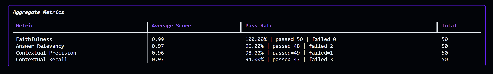

# 🏛️ University RBAC Hybrid RAG

A multi-tenant intelligence platform combining **Text-to-SQL**, **Hybrid RAG**, and **Semantic Caching** under **Role-Based Access Control (RBAC)**.

---

## 🌟 System Architecture Overview

```
                            ┌──────────────────────────────────────────────┐
                            │    Streamlit Web UI (5 Role Portals)         │
                            └──────────────────────┬───────────────────────┘
                                                   │ HTTP POST {question, role, thread_id}
                                                   ▼
                            ┌──────────────────────────────────────────────┐
                            │       FastAPI Backend API (main.py)          │
                            └──────────────────────┬───────────────────────┘
                                                   │
                                                   ▼
                            ┌──────────────────────────────────────────────┐
                            │  ⚡ Semantic Cache (BGE-Small, Cosine >= 0.85)│ ──(HIT <5ms)──► Fast Cache Return
                            └──────────────────────┬───────────────────────┘
                                                   │ (MISS)
                                                   ▼
┌────────────────────────────────────────────────────────────────────────────────────────────────────────┐
│  LangGraph ReAct Agent (Role-Scoped Execution)  ◄───►  🧠 Short-Term Memory (MemorySaver: thread_id)   │
└───────────────────────────────────┬──────────────────────────────────────┬─────────────────────────────┘
                                    │                                      │
                                    ▼                                      ▼
     ┌──────────────────────────────────────────────┐       ┌──────────────────────────────────────────────┐
     │ 🗄️ Text-to-SQL Engine (Role-Isolated Views)   │       │ 📄 Hybrid RAG Engine (Qdrant + Jina v3.5)     │
     │ • students_public / faculty / advisor / dean │       │ 1. Decompose Query ➔ 2. BGE + BM42 Retrieval │
     │ • Read-Only Schema Protection & Execution    │       │ 3. Qdrant metadata.tier filter ➔ 4. Rerank   │
     └──────────────────────┬───────────────────────┘       └──────────────────────┬───────────────────────┘
                            │                                                      │
                            └──────────────────────────┬───────────────────────────┘
                                                       ▼
                            ┌──────────────────────────────────────────────┐
                            │  Qwen 3.6 27B Synthesis (Grounded + Badged)  │ ──► Store Cache & Return
                            └──────────────────────────────────────────────┘
```

---

## 🛡️ Multi-Tenant RBAC Security Architecture

| Role Portal | Role Code | Default Password | Access Level & Scope |
| :--- | :---: | :---: | :--- |
| **🎓 Student Portal** | `public` | `student123` | Public catalog, placement stats, academic calendars & hostel policies. |
| **👨‍🏫 Faculty Portal** | `faculty` | `faculty123` | Student grades, CGPA, backlogs, course syllabi, lesson plans & rubrics. |
| **🧭 Advisor Portal** | `advisor` | `advisor123` | Tuition fees, attendance audits, scholarships & academic standing. |
| **🏛️ Dean Portal** | `dean` | `dean123` | Full student DB, active disciplinary flags, strategic plans & tenure records. |
| **⚙️ Admin Portal** | `admin` | `admin123` | **Vector DB Management**: Live document inventory, tier ingestion & deletion. |

### 1. Structured Database Partitioning (SQLite)
* **`students_public`**: Non-sensitive enrollment (`pin_number`, `branch`, `semester`, `placement_package_lpa`).
* **`students_faculty`**: Adds academic standing (`student_name`, `cgpa`, `active_backlogs`, `attendance_percentage`).
* **`students_advisor`**: Adds financial & scholarship audits (`tuition_fee_due`, `scholarship_type`).
* **`students_dean`**: Full institutional governance including `disciplinary_flag` (1 = flagged, 0 = clean).

### 2. Unstructured Document Partitioning (Qdrant Payload Filtering)
Document chunks are tagged with `metadata.tier` (`public` ⊂ `faculty` ⊂ `advisor` ⊂ `dean`) and strictly filtered before retrieval.

---

## 📊 Evaluation Benchmarks

### 🎯 1. Router & Text-to-SQL Evaluation
| Component | Tests | Pass Rate | Result |
| :--- | :---: | :---: | :--- |
| **Router Classification** | SQL vs RAG Intent | **100%** (16/16) | 🏆 Flawless intent routing |
| **SQL RBAC Isolation** | Column & Table Shielding | **100%** (4/4) | 🔒 Zero data leakage across roles |
| **SQL Query Accuracy** | Analytical Aggregates | **100%** | 🟢 Safe read-only SQLite execution |

```powershell
uv run python test/router.py
```

### 💰 2. In-Memory Semantic Cache Performance
Layered at pipeline entry (`bge-small-en-v1.5` + Qdrant in-memory, `threshold=0.85`):

| Metric | Result | Metric | Result |
| :--- | :---: | :--- | :---: |
| **Cold Pipeline Latency** | 2.926s | **Identical Query Hit Rate** | **100%** (8/8) |
| **Cache Hit Latency** | **0.005s** | **Paraphrase Hit Rate** | **100%** (8/8) |
| **Speedup on Cache Hits** | 🔥 **629x faster** | **Tokens Saved** | ~14,400 / run |

```powershell
uv run python test/cache.py
```

### 🚀 3. DeepEval RAG Benchmarks (50 Test Cases)

<div align="center">
  
</div>

#### 📈 Retrieval Architecture Progression (72% ➔ 88% SOTA):

| Stage & Optimization | Pass Rate | Faithfulness | Relevancy | Precision | Recall | Snapshot |
| :--- | :---: | :---: | :---: | :---: | :---: | :---: |
| **1. Dense Semantic Baseline** | 72% (36/50) | 0.99 | 0.97 | 0.85 | 0.95 | [CLI](assets/dense_cli.png) |
| **2. + Hybrid (BGE-Small + Sparse)** | 78% (39/50) | 0.96 | 0.98 | 0.94 | 0.95 | [CLI](assets/hybrid_cli.png) |
| **3. + Cross-Encoder Rerank** | 84% (42/50) | 0.96 | 0.97 | 0.97 | 0.95 | [CLI](assets/rerank_cli.png) |
| **4. + Query Decomposition & CoT** | 86% (43/50) | 0.99 | 0.95 | 0.97 | 0.95 | [CLI](assets/decomp_cli.png) |
| **5. + Jina Rerank v3.5 + BM42** | **88% (44/50)** 🚀 | **0.99** | **0.97** | **0.96** | **0.97** | [CLI](assets/jina_cli.png) |

#### ⚡ Sparse Model Efficiency & Trade-off Study:
| Sparse Model | Size | Pass Rate | Key Takeaway |
| :--- | :---: | :---: | :--- |
| **SPLADE++ (`Splade_PP_en_v1`)** | ~532 MB 🐘 | **88.0%** (44/50) | High accuracy, heavy memory footprint. |
| **BM25 (`Qdrant/bm25`)** | ~5 MB ⚡ | **82.0%** (41/50) | Ultra-light, but dropped 6% on semantic paraphrases. |
| **BM42 (`bm42-all-minilm-l6-v2`)** | **~90 MB** ✅ | **88.0%** (44/50) 🚀 | **Production SOTA:** 6× lighter than SPLADE with full 88% accuracy. |

#### 🎯 Production Aggregate Metrics:
| Metric | Average Score | Pass Rate | Result |
| :--- | :---: | :---: | :--- |
| **Faithfulness** | **0.99** | **100.00%** (50/50) | 🟢 Flawless factual grounding (zero hallucinations) |
| **Answer Relevancy** | **0.97** | **96.00%** (48/50) | 🟢 Direct, context-focused responses |
| **Contextual Precision** | **0.96** | **98.00%** (49/50) | 🟢 Top-ranked ground truth chunk alignment |
| **Contextual Recall** | **0.97** | **94.00%** (47/50) | 🟢 Full coverage of required domain context |

* **Overall Pass Rate:** **88.0% (44/50 passed all 4 criteria)** 🚀
* **RBAC Isolation:** **36/36 checks passed (100% Enforced)** 🔒

---

## 📁 Repository Structure

```
RAG/
├── assets/                 # Evaluation screenshots and diagrams (bm42.png)
├── data/                   # 200 student records (students.csv, students.db) & tier PDFs
├── qdrant_db/              # Local Qdrant hybrid vector store (Dense + BM42)
├── src/
│   ├── admin.py            # Admin vector database management (list, ingest, delete)
│   ├── cache.py            # In-memory semantic cache (BGE-small + Qdrant)
│   ├── config.py           # Model configs (Qwen 27B, BM42, BGE-small, Jina v3.5)
│   ├── db.py               # SQLite initialization & 4 role schemas
│   ├── graph_router.py     # LangGraph ReAct agent + MemorySaver + SQL tools
│   ├── ingester.py         # Recursive PDF loader with RBAC tier tagging
│   ├── observability.py    # Native LangSmith tracing
│   ├── rag_engine.py       # Multi-stage RAG (Decompose ➔ Hybrid ➔ Jina Rerank)
│   └── retriever.py        # Role-filtered Qdrant vector store (Dense + BM42)
├── test/                   # QA.json (50 cases), eval.py (DeepEval), cache.py, router.py
├── scripts/                # Synthetic student CSV & ReportLab PDF generators
├── app.py                  # Streamlit Multi-Tenant Frontend (5 Role Portals)
├── main.py                 # FastAPI High-Performance Backend REST API
├── pyproject.toml          # UV dependencies & project metadata
└── README.md               # Project documentation & benchmark metrics
```

---

## 🚀 Quickstart Guide

### 1. Install & Configure
```powershell
uv sync
```
Create `.env`:
```env
GROQ_API_KEY=your_groq_api_key
GROQ_MODEL=qwen/qwen3.6-27b
JINA_API_KEY=your_jina_api_key
QDRANT_PATH=./qdrant_db
COLLECTION_NAME=univ_hybrid_rag
```

### 2. Ingest Data & Run Benchmarks
```powershell
# Ingest 12 PDFs with BM42 (~10s)
uv run python -m src.ingester

# Run benchmarks
uv run python test/router.py   # Intent & SQL RBAC (100%)
uv run python test/cache.py    # Semantic Cache (629x speedup)
uv run python test/eval.py     # DeepEval 50 Questions (88% SOTA)
```

### 3. Launch Application
```powershell
# Terminal 1 (Backend):
uv run python main.py

# Terminal 2 (Frontend):
uv run streamlit run app.py
```
Access the application at `http://localhost:8501`. 🎉

